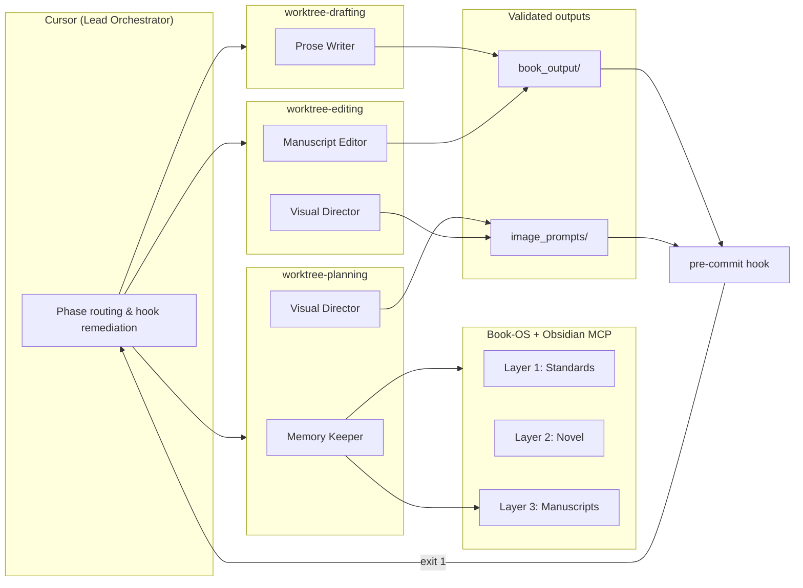

# AI Book Creator

**Autonomous multi-agent publishing studio for long-form fiction and coordinated visual assets.**

Cursor acts as the Lead Orchestrator. Specialized AI agents work in isolated Git worktrees to plan, draft, edit, and illustrate a novel without context rot, file collisions, or unvalidated AI prose slipping into the manuscript.

Built for authors who want a reproducible, self-correcting pipeline—not a one-shot chat session.

---

## What This Does

| Capability | How |
|------------|-----|
| **Narrative planning** | Memory Keeper builds arcs and scene-by-scene outlines in the planning worktree |
| **Prose generation** | Prose Writer drafts chapters under a Rolling Context Window (never the full manuscript) |
| **Editorial QA** | Manuscript Editor refines drafts; a Python pre-commit hook blocks bad commits before they land |
| **Visual consistency** | Visual Director generates per-chapter prompts and a full cover suite locked to a visual language bible |
| **Lore retrieval** | Obsidian MCP server provides DeepLore-style two-stage retrieval from your Book-OS vault |
| **Parallel safety** | Three locked Git worktrees let agents run concurrently without overwriting each other |

---

## Architecture



---

## Pipeline Phases

Full specification: [`docs/prd.md`](docs/prd.md)

| Phase | Agent(s) | Worktree | Output |
|-------|----------|----------|--------|
| **1** — High-level arcs | Memory Keeper + Visual Director | `worktree-planning` | Arc table in `writing-plan.md` |
| **2** — Scene outlines | Memory Keeper | `worktree-planning` | Per-chapter scene beats |
| **2.5** — Chapter visuals | Visual Director | `worktree-planning` | `image_prompts/chapters/` |
| **3** — Prose drafting | Prose Writer | `worktree-drafting` | `book_output/` |
| **4** — Editorial pass | Manuscript Editor + Visual Director | `worktree-editing` | Refined prose + prompt consistency |
| **5** — Cover suite | Visual Director | `worktree-editing` | `image_prompts/covers/` |

### Rolling Context Window

When drafting **Chapter N**, the Prose Writer receives **only**:

1. Global synopsis and lore constraints (via MCP)
2. The granular outline for Chapter N
3. Finalized text of Chapter N−1

Never feed the full manuscript. This preserves continuity while keeping token use and KV-cache churn under control.

### Self-Healing Validation Loop

Every commit to `book_output/` or `image_prompts/` runs through `hooks/pre-commit`. On failure (exit 1):

1. Read the stderr violation report
2. Route prose failures → Manuscript Editor; visual failures → Visual Director
3. Fix, re-stage, re-commit — **never** use `--no-verify`

---

## Agent Roster

| Agent | Model tier | Worktree | Role |
|-------|------------|----------|------|
| **Memory Keeper** | Opus 4.8 | planning | Arcs, outlines, continuity, lore sync |
| **Prose Writer** | Sonnet 5 | drafting | Chapter prose (`ghostproof-lite` enforced) |
| **Manuscript Editor** | Nemotron 3 Ultra | editing | Structural and stylistic refinement |
| **Visual Director** | Opus 4.8 | planning / editing | Chapter prompts + cover suite |

Persona definitions: [`.claude/agents/`](.claude/agents/)

---

## Book-OS Context Hierarchy

| Layer | Path | Purpose |
|-------|------|---------|
| **L1 — Standards** | `.novel-os/standards/` | Writing DNA + visual language bible (immutable aesthetic law) |
| **L2 — Novel** | `.novel-os/novel/` | Premise, creative decisions, character profiles |
| **L3 — Manuscripts** | `.novel-os/manuscripts/` | Writing plan, scene tasks, visual prompt registry |

Fill **Layer 1 and 2** before Phase 1:

- [`.novel-os/standards/visual-language.md`](.novel-os/standards/visual-language.md) — replace all `[DEFINE]` placeholders
- [`.novel-os/novel/premise.md`](.novel-os/novel/premise.md) — logline, synopsis, series metadata

---

## Prerequisites

- **Git** with worktree support
- **Bash** (Git Bash or WSL on Windows) for `sync-worktrees.sh`
- **Python 3** (pre-commit hook)
- **Bun** (Obsidian MCP server runner)
- **Cursor** with MCP enabled
- **Obsidian** with the [Local REST API](https://github.com/coddingtonbear/obsidian-local-rest-api) community plugin

---

## Quick Start

### 1. Clone and initialize worktrees

```bash
git clone https://github.com/reversesingularity/ai-book-creator.git
cd ai-book-creator
bash sync-worktrees.sh
```

This creates three locked worktrees under `.worktrees/`:

| Worktree | Branch |
|----------|--------|
| `worktree-planning` | `agent/planning` |
| `worktree-drafting` | `agent/drafting` |
| `worktree-editing` | `agent/editing` |

Each worktree gets `book_output/` and `image_prompts/` output trees. The validation hook is installed to the shared `.git/hooks/` directory.

### 2. Configure Obsidian MCP (secrets via `.env`)

```bash
cp .env.example .env
# Edit .env — set your Local REST API key:
#   OBSIDIAN_API_KEY=your-key-here
```

Cursor reads [`.cursor/mcp.json`](.cursor/mcp.json), which loads secrets from `.env` via `envFile`. **Never commit `.env`.**

Ensure Obsidian is running with Local REST API enabled (default port `27124`).

Restart Cursor after creating `.env`, then verify under **Customize → MCP** that `obsidian-lore` shows connected tools.

### 3. Fill creative templates

Before Phase 1, complete the human-author placeholders in:

- `.novel-os/standards/visual-language.md`
- `.novel-os/novel/premise.md`

### 4. Run the pipeline

Follow [`docs/prd.md`](docs/prd.md) phase by phase. Cursor orchestrates agents; each agent stays inside its assigned worktree.

---

## Repository Layout

```
ai-book-creator/
├── .cursor/mcp.json          # Cursor MCP config (loads .env)
├── .claude/
│   ├── agents/               # BYOA persona definitions
│   └── skills/ghostproof-lite.md
├── .novel-os/                # Book-OS three-layer context
│   ├── standards/
│   ├── novel/
│   └── manuscripts/
├── docs/prd.md               # Pipeline mandate (source of truth)
├── hooks/pre-commit          # Prose + visual prompt validation
├── sync-worktrees.sh         # Worktree + hook bootstrap
├── mcp.json                  # Mirror of .cursor/mcp.json (no secrets)
├── .env.example              # Template for Obsidian API key
├── book_output/              # Final chapter prose (per worktree)
└── image_prompts/            # Chapter + cover prompts (per worktree)
```

---

## Validation Rules (Pre-Commit Hook)

The hook enforces quality gates on staged files in `book_output/` and `image_prompts/`:

**Prose**

- Minimum **1,500 words** per chapter file
- **ICK list** banned phrases (e.g. "palpable tension", "ghost of a smile")
- No unresolved plot flags (`TODO`, `TBD`, `[PLOT-FLAG]`, etc.)
- No raw Markdown code blocks in narrative
- Em-dash cap per scene

**Visual prompts**

- Minimum character length
- Required YAML frontmatter structure

Full editorial constraints: [`.claude/skills/ghostproof-lite.md`](.claude/skills/ghostproof-lite.md)

---

## Orchestration Rules

1. **Worktree isolation** — agents operate only inside their assigned worktree
2. **Rolling Context Window** — never pass the full manuscript to the Prose Writer
3. **Hook compliance** — remediate and retry; never bypass with `--no-verify`
4. **Visual language is law** — all image prompts must comply with `visual-language.md`
5. **MCP-scoped writes** — agents may only write to paths defined in MCP config

---

## Security

| File | Commit? |
|------|---------|
| `.env` | **No** — gitignored |
| `.env.example` | Yes — empty template |
| `mcp.json` / `.cursor/mcp.json` | Yes — no API keys, uses `envFile` |
| `.worktrees/` | **No** — gitignored (local agent sandboxes) |

---

## Further Reading

- [`docs/prd.md`](docs/prd.md) — full pipeline specification
- [`architectural-blueprint-multi-agent-orchestration-book-writer.md`](architectural-blueprint-multi-agent-orchestration-book-writer.md) — deep architecture notes

---

## Author

[reversesingularity](https://github.com/reversesingularity)
